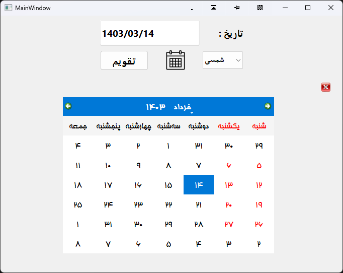

# Shamsi-Miladi-Calendar_Jalali-Gregorian

This project is a simple Calendar of jalali or *Hijri Shamsi* and Gregorian or *Hijri Miladi* .

---

1. Open Calendar with two buttons
2. Close Calendar with X button
3. Switch to Jalali or Gregorian with a QCombo Box
4. Show your selected date in QLine edit

---
 

